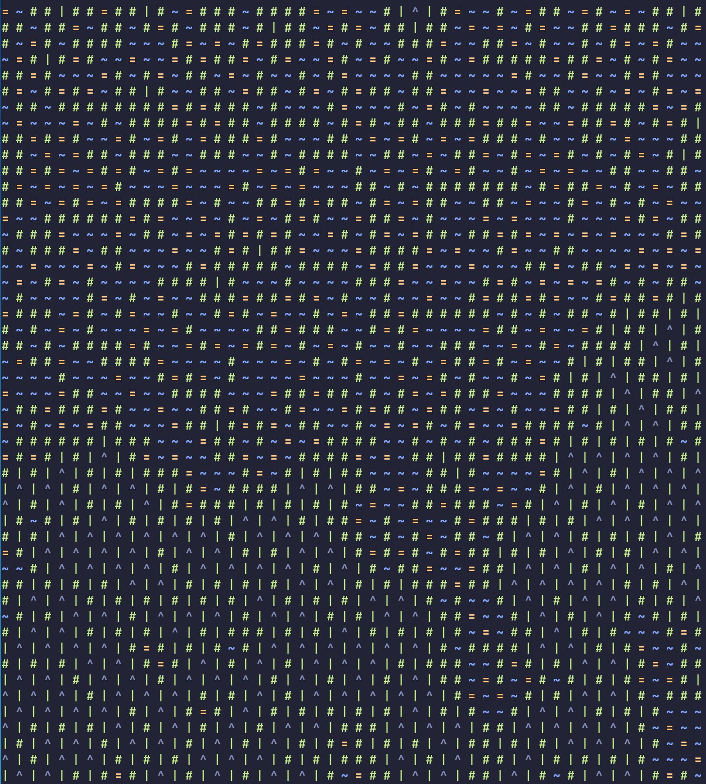

# Python WFC
An implementation of the wave function collapse algorithm that reads a tile set and example tile layout from a file.

### Usage
```
python wfc.py filename
```
Example:
```
python wfc.py tileset.json
```
### Example Output:


### File Layout
- tiles - a list of strings for each tile
- input_tiles - a 2D array containing the example tile set
- format - a boolean indicating wether or not to append "\x1b[" + TILE_STRING + "\x1b[0m"
- width - integer describing the output width
- height - integer describing the output height

Example:
``` JSON
{
    "tiles": ["1;34m~", "1;33m=", "1;32m#", "32m|", "1;37m^"],
    "input_tiles": [[1, 1, 1, 1, 1, 1, 1],
                    [1, 2, 3, 3, 3, 2, 1],
                    [1, 3, 3, 4, 3, 3, 1],
                    [1, 3, 4, 5, 4, 3, 1],
                    [1, 3, 3, 4, 3, 3, 1],
                    [1, 2, 3, 3, 3, 2, 1],
                    [1, 1, 1, 1, 1, 1, 1]],
    "format": true,
    "width": 20,
    "height": 20
}
```
