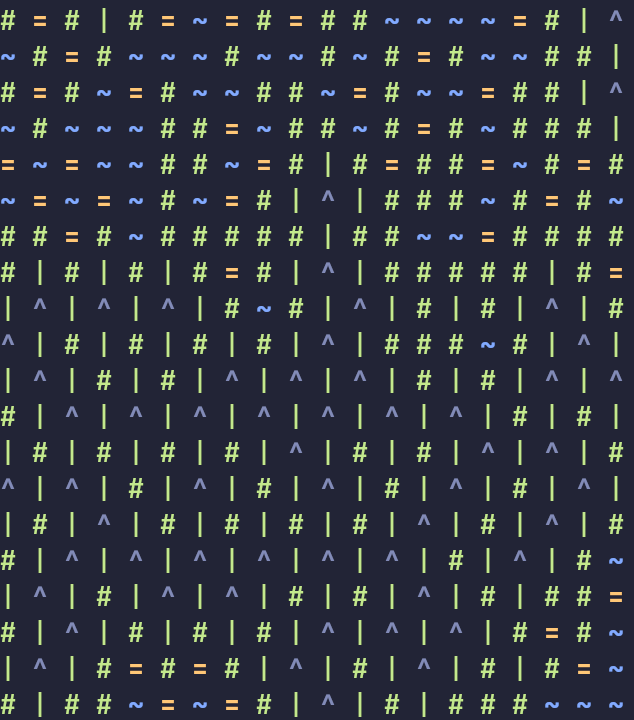

# Python WFC
An implementation of the wave function collapse algorithm.
See [here](wfc/core.py) for the core implementation.

## Examples

### Usage
See examples/cli

```
python examples/cli/main.py filename
```
Example:
```
python examples/cli/main.py examples/cli/tileset1.json
```
### Example Output:


### File Layout
- tiles - a list of strings for each tile
- input_tiles - a 2D array containing the example tile set
- width - integer describing the output width
- height - integer describing the output height

Example:
``` JSON
{
    "tiles": ["\u001B[1;34m~\u001B[0m", "\u001B[1;33m=\u001B[0m", "\u001B[1;32m#\u001B[0m", "\u001B[32m|\u001B[0m", "\u001B[1;37m^\u001B[0m"],
    "input_tiles": [[1, 1, 1, 1, 1, 1, 1],
                    [1, 2, 3, 3, 3, 2, 1],
                    [1, 3, 4, 4, 4, 3, 1],
                    [1, 3, 4, 5, 4, 3, 1],
                    [1, 3, 4, 4, 4, 3, 1],
                    [1, 2, 3, 3, 3, 2, 1],
                    [1, 1, 1, 1, 1, 1, 1]],
    "width": 20,
    "height": 20
}
```
